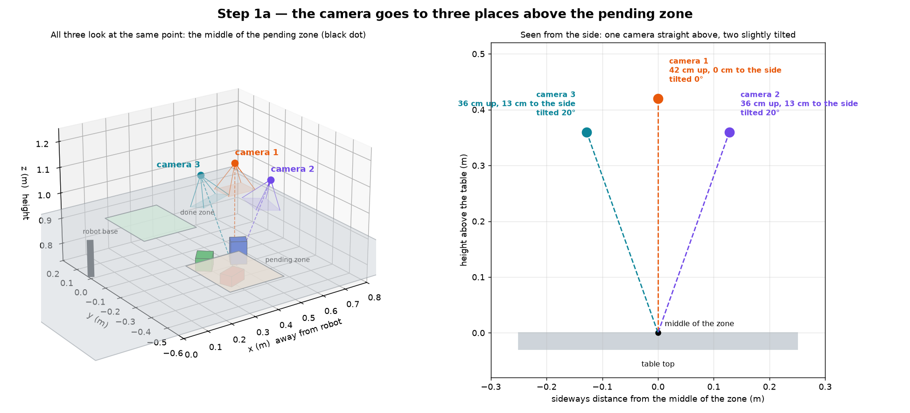
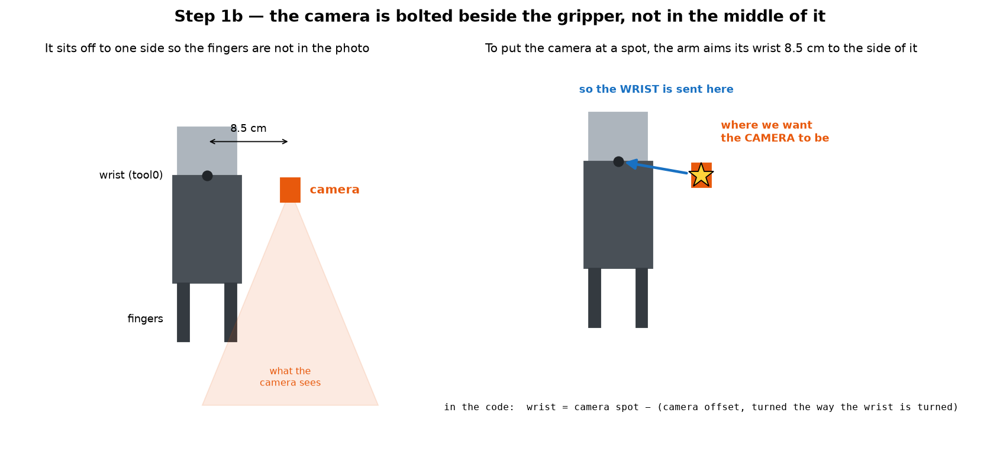
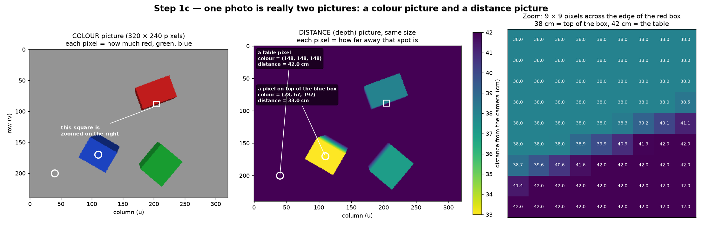
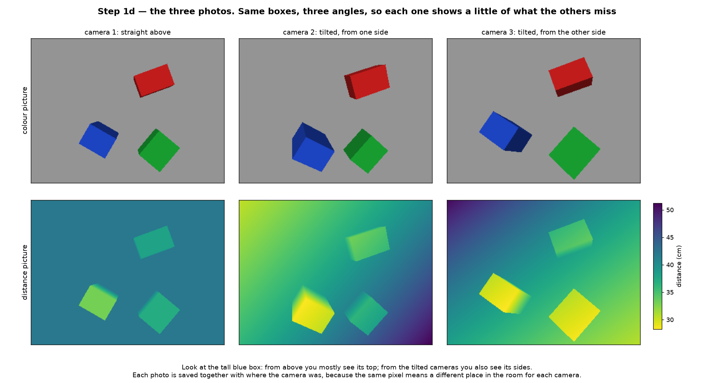

# Step 1: taking three pictures

Before the arm can measure anything, it looks at the table. The camera moves
to three places above the pending zone and takes one picture at each. This
happens in `_look()` in `task.py`.

The pictures below use the project's real numbers. The three boxes are made
up for the example, and the photos are drawn by a small script, not by
Gazebo, so they look simpler than the real ones.

## 1. Where the camera goes



All three positions are measured from the middle of the pending zone, which is
at x = 0.44 m, y = −0.28 m on the table top. The numbers are
`SURVEY_OFFSETS` in `task.py`.

| Camera | Where | Tilt |
| --- | --- | --- |
| 1 | 42 cm straight above the middle | none, looks straight down |
| 2 | 36 cm up, 13 cm to one side | about 20° |
| 3 | 36 cm up, 13 cm to the other side | about 20° |

**Which way it looks.** Each offset is an arrow from the middle of the zone to
the camera. Turn the arrow around and it points from the camera back to the
middle. So the code uses `-offset` as the looking direction, and all three
cameras look at the same point.

**Why three pictures.** From straight above you mostly see the tops of the
boxes, and a tall box can hide part of another. The tilted cameras see some of
the sides and some of what was hidden.

**Does the whole zone fit?** Yes. From 42 cm up the camera sees about
48 × 36 cm of table. The zone is 24 × 28 cm. One pixel covers about 1.5 mm.

## 2. Putting the camera there



The camera is bolted 8.5 cm to one side of the wrist, so the fingers stay out
of the picture (`CAMERA_OFFSET` in `arm/dimensions.py`). The arm is always told
where its wrist goes. So to put the camera at a spot, the wrist is sent
8.5 cm to the side of that spot:

```python
wrist = camera_spot - rotation @ CAMERA_OFFSET
```

`rotation @` is there because the 8.5 cm is measured in the wrist's own
directions. When the wrist turns, the direction of the step turns with it.

Two details:

- Spinning the camera around the direction it looks only rotates the picture.
  It does not change what is in it. So the code tries up to 6 spin angles and
  keeps the first one the arm can reach.
- If the arm cannot reach a position at all, that picture is skipped. Two
  pictures still work, just a little less well.

## 3. What one picture holds



The camera is an RGB-D camera. One shot gives two pictures of the same size,
320 × 240 pixels.

**The colour picture.** Each pixel is three numbers from 0 to 255: how much
red, green and blue it has. Grey table is (148, 148, 148). These are RGB
values, straight from the camera. HSV is not from the camera; the code
makes it from these RGB numbers later, in step 2.

**The distance (depth) picture.** Each pixel is one number: how far away that
spot is, in metres. In the zoom on the right, the box top reads 38 cm and the
table reads 42 cm. The camera is 42 cm above the table and the box is 4 cm
tall, so its top is 4 cm closer. That jump in the numbers is how a box shows
up.

The distance is measured straight along the direction the camera looks, not
along a slanted line. That is why the whole table reads 42 cm from camera 1,
even at the corners.

`camera.capture()` hands back four things together:

| What | In simple words |
| --- | --- |
| `rgb` | the colour picture |
| `depth` | the distance picture |
| `intrinsics` | four numbers about the lens: `cx = 160`, `cy = 120` is the middle pixel, and `fx = fy ≈ 277` says how zoomed in the lens is |
| `camera_to_world` | where the camera was, and which way it faced, when it took the picture |

**Where 277 comes from.** The picture is 320 pixels wide and the camera sees
60° across (`wrist_camera.urdf.xacro`). Half the width divided by tan of half
the angle: 160 / tan(30°) = 160 / 0.577 ≈ 277. In a real run the code does not
calculate it. Gazebo sends it with every frame, and the code reads it.

**How the camera position is stored.** A picture on its own says "this is 38
cm in front of me". To know where that is in the room, you also need to know
where "me" was. So every picture is saved with the camera's position and the
way it faced, as one 4 × 4 table of numbers called `camera_to_world`.

For camera 1 (straight above) it is:

|        | camera's RIGHT | camera's DOWN | camera's FORWARD | camera's POSITION |
| ---    | :---: | :---: | :---: | :---: |
| room x | −1 | 0 | 0 | 0.44 |
| room y | 0 | 1 | 0 | −0.28 |
| room z | 0 | 0 | −1 | 1.17 |
|        | 0 | 0 | 0 | 1 |

- **The last column is where the camera was**, in metres, in room
  coordinates. The height is z = 1.17 m, measured from the floor. The table
  top is at 0.75 m, so the camera was 1.17 − 0.75 = 0.42 m above the table.
- **The first three columns are directions.** They say which way the camera's
  right, down and forward point in the room. Camera 1's forward is (0, 0, −1),
  which is straight down. Its right is (−1, 0, 0), towards the robot.
- **The bottom row is always 0 0 0 1.** It is there only so the maths fits in
  one multiplication.

A tilted camera has the same layout with different numbers. Camera 2's forward
is (−0.26, 0.21, −0.94): mostly down, leaning a little sideways.

**Where the numbers come from.** The camera does not know where it is. The
arm's motors report their six joint angles, and ROS knows the length of every
arm part from the robot model. It adds the parts up and gets where the camera
is. `capture()` asks ROS for this at the moment of the picture. ROS answers
with 3 numbers for the position and 4 for the direction, and
`transform_to_matrix()` turns those into the 4 × 4 table.

The name says what it is for: it takes a point measured from the camera and
gives the same point in room (world) coordinates. Step 2 does exactly that.

**A fresh picture every time.** `capture()` throws away any picture it already
has and waits for a new one. An old picture might have been taken while the arm
was still moving.

## 4. The three pictures



Same boxes, three angles. From above you mostly see the top of the tall blue
box. From the tilted cameras you also see its sides. In the tilted distance
pictures, the table's distance changes smoothly across the picture, because
the camera looks at it at a slant.

## What comes out of step 1

Three sets of `rgb`, `depth`, `intrinsics` and `camera_to_world`, one for each
camera position. Nothing has been measured yet.

Step 2 finds the box pixels in each picture and turns them into points in the
room.

The same `_look()` runs again later, closer in and over a single box, to
measure it a second time after it has been moved.
