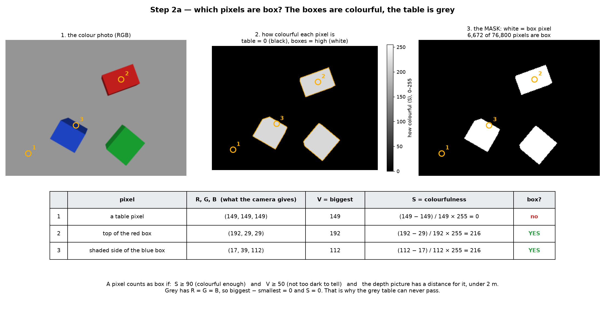
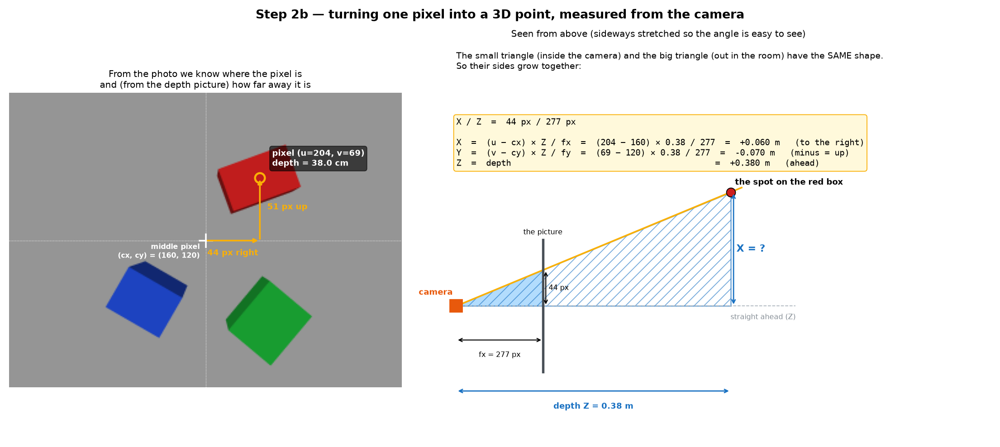
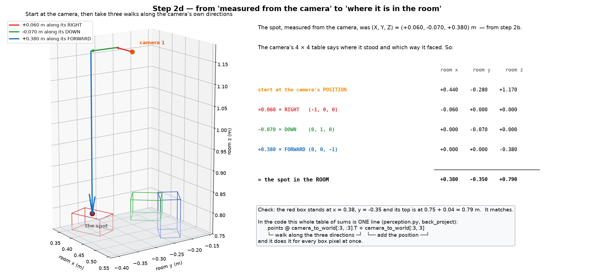
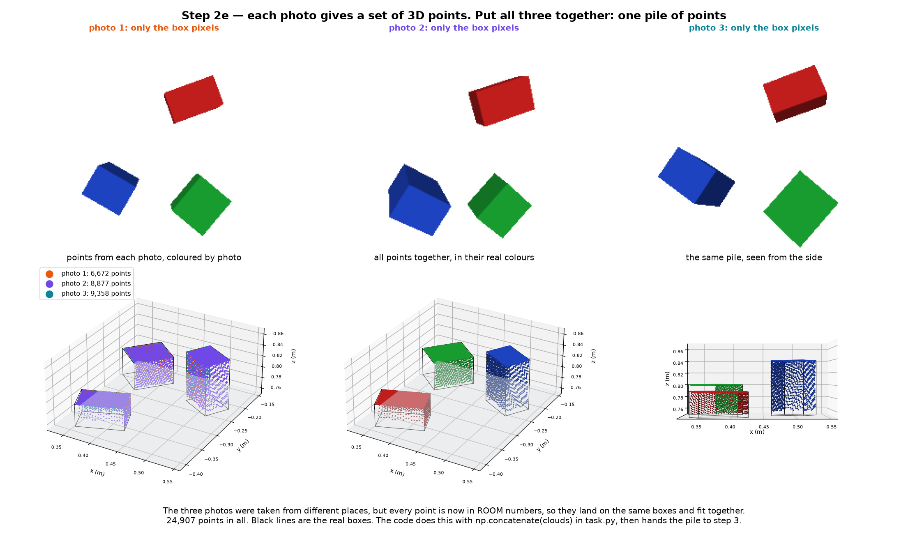
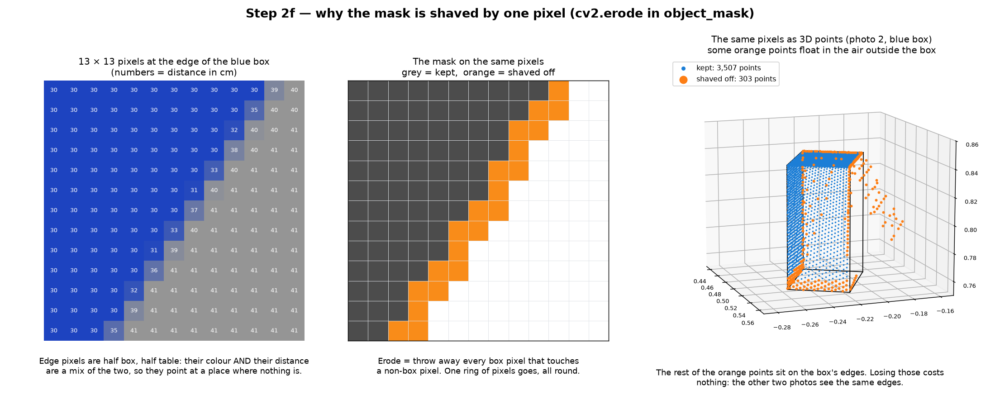

# Step 2: from pictures to 3D points

Step 1 gave us three pictures. Step 2 turns them into one pile of points in
the room, one point for every pixel that shows a box. It is two lines in
`_look()` (`task.py:190-191`), run once for each picture:

```python
mask = object_mask(view.rgb, view.depth)
clouds.append(back_project(view.depth, mask, view.intrinsics, view.camera_to_world))
```

The pictures below run the project's real `object_mask()` and
`back_project()` on drawn photos. The photos blend colours at the box edges,
the way a real camera does, so a few numbers differ slightly from step 1.

## 1. Which pixels are box?



The boxes are painted in strong colours and the table is grey. So the code
asks one question of every pixel: how colourful is it?

The camera gives RGB. The code turns it into HSV, which has one number, **S**,
for exactly this:

```
S = (biggest of R, G, B − smallest) / biggest × 255
V = biggest of R, G, B
```

| Pixel | R, G, B | S | Box? |
| --- | --- | --- | --- |
| table | (149, 149, 149) | (149 − 149) / 149 × 255 = 0 | no |
| top of the red box | (192, 29, 29) | (192 − 29) / 192 × 255 = 216 | yes |
| shaded side of the blue box | (17, 39, 112) | (112 − 17) / 112 × 255 = 216 | yes |

Grey always has R = G = B, so its S is always 0. That is why the table can
never pass.

A pixel counts as box if all of these are true (`perception.py:55`):

- S ≥ 90: colourful enough;
- V ≥ 50: not too dark to tell;
- the distance picture has a distance for it, under 2 m.

The answer is kept as a **mask**: a black-and-white picture, white where a
pixel is box. In camera 1's picture, 6,672 of 76,800 pixels are box. The rest,
the table, is thrown away here and never becomes a point.

Last, the mask is shaved by one pixel all round. Section 5 explains why.

## 2. One pixel → a point measured from the camera



Take one box pixel: column u = 204, row v = 69. The distance picture says it is
0.38 m away. The lens numbers from step 1 are fx = fy ≈ 277 and a middle pixel
of (160, 120).

The pixel is 44 pixels right of the middle and 51 pixels above it. The small
triangle inside the camera and the big triangle out in the room have the same
shape, so their sides grow together:

```
X = (u − cx) × depth / fx = (204 − 160) × 0.38 / 277 = +0.060 m   (right)
Y = (v − cy) × depth / fy = ( 69 − 120) × 0.38 / 277 = −0.070 m   (up)
Z = depth                                            = +0.380 m   (ahead)
```

This is the spot **measured from the camera**: 6 cm to its right, 7 cm up,
38 cm ahead. It does not yet say where that is in the room.

## 3. From the camera to the room



This is where the camera's 4 × 4 table from step 1 is used. It says where the
camera stood and which way its right, down and forward pointed. So:

**start at the camera's position, then walk X along its right, Y along its
down, and Z along its forward.**

```
  (0.44, −0.28,  1.17)    the camera's position
+ (−0.06,  0.00,  0.00)   0.060 × RIGHT   (−1, 0, 0)
+ ( 0.00, −0.07,  0.00)  −0.070 × DOWN    ( 0, 1, 0)
+ ( 0.00,  0.00, −0.38)   0.380 × FORWARD ( 0, 0, −1)
= (0.38, −0.35,  0.79)    the spot, in the room
```

Check: the red box stands at x = 0.38, y = −0.35, and its top is at
0.75 + 0.04 = 0.79 m. It matches.

In the code this is one line, done for every box pixel at once
(`perception.py:96`):

```python
points @ camera_to_world[:3, :3].T + camera_to_world[:3, 3]
#        walk along the three directions   add the position
```

## 4. Joining the three pictures



Each picture gives its own list of points: 6,672 from camera 1, 8,877 from
camera 2 and 9,358 from camera 3. They were taken from different places, but
every point is now in room coordinates, so they land on the same boxes and fit
together. `np.concatenate(clouds)` (`task.py:195`) puts them in one list of
24,907 points.

A few things about this pile:

- **They are 3D points, not pixels.** Each one is an (x, y, z) in metres.
- **Every point is on a box.** The table was removed in section 1.
- **Every point is on a box's outside surface.** A camera only sees surfaces,
  so there are points on the tops and on some sides, never inside.
- **We do not yet know which box each point is on.** The points carry no
  colour or label. Step 3 sorts that out.
- **There are near-duplicates.** Where two cameras saw the same spot, there
  are two points almost on top of each other. That is fine: step 3 only needs
  the outline and the highest point of each box, and a second point in the
  same place changes neither.

## 5. Why the mask is shaved by one pixel



A pixel on the edge of a box sees half box and half table. Its colour is a
mix, and so is its distance: 35 cm where the box top is 30 and the table 41.
Turned into a point, it lands in mid-air where nothing is. Those floating
points would make the box look bigger in step 3.

So `object_mask()` ends with `cv2.erode`, which drops every box pixel that
touches a non-box pixel: one ring all round (`perception.py:76`). This happens
in each picture, before any pixel becomes a point, so the floating points are
never made.

Some of the dropped pixels were good edge pixels. That costs little, because
the other two pictures see the same edges. It is also why step 3 measures
lengths and widths up to about 3 mm short.

## What comes out of step 2

One list of about 25,000 (x, y, z) points, all on the surfaces of boxes, in
room coordinates.

Step 3 groups them into one lump per box and measures each lump.
