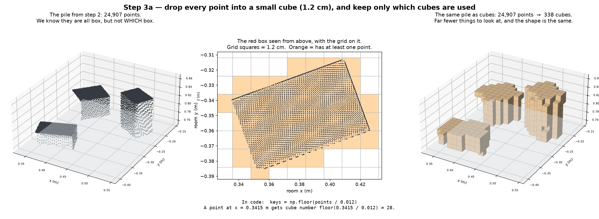
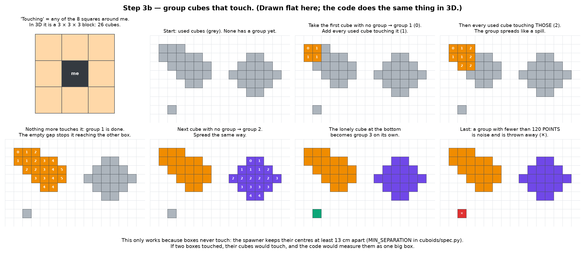
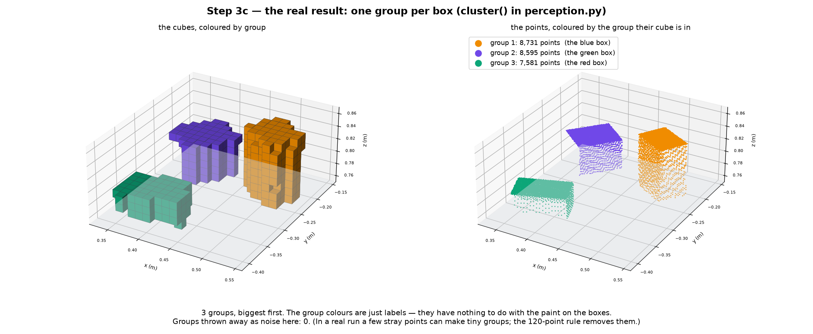
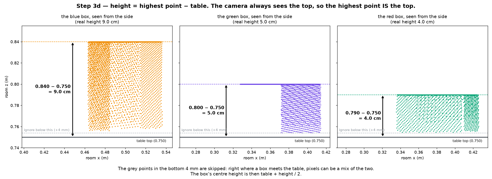
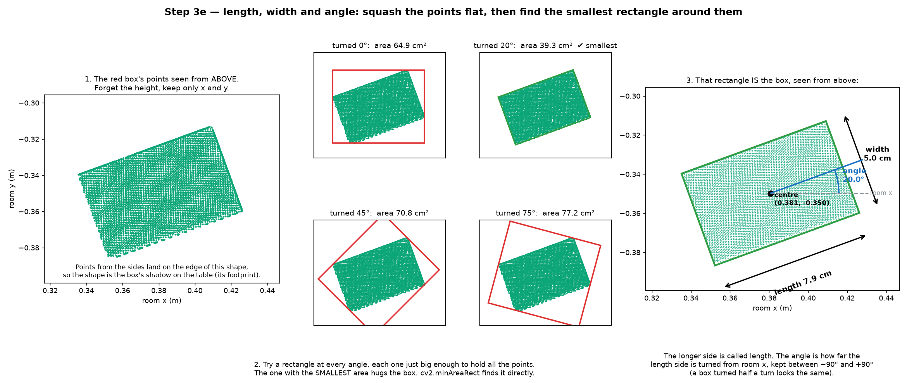
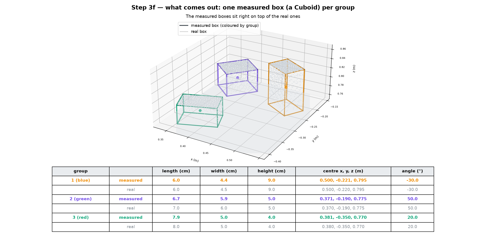

# Step 3: from points to measured boxes

Step 2 gave us about 25,000 points, all on the surfaces of boxes. We know they
are all box, but not which box each one is on. Step 3 splits them into one
group per box, then measures each group. It is `find_cuboids()` in
`cuboids/perception.py`, and it does two things:

- `cluster()` splits the pile into groups;
- `fit_cuboid()` measures one group and returns a box.

The pictures below run the project's real `cluster()` and `fit_cuboid()` on
the points from step 2.

## 1. Drop the points into small cubes



Split the room into cubes 1.2 cm on each side. Each point falls into exactly
one cube (`perception.py:110`):

```python
keys = np.floor(points / 0.012)     # x = 0.3415 m  →  cube number 28
```

Then keep only the list of cubes that have at least one point in them. Here,
24,907 points fill just 338 cubes, and the shape stays the same.

**Why bother?** To find which points are near each other, you would have to
compare every point with every other one: 25,000 × 25,000 = 625 million
comparisons. With cubes, each cube only checks the 26 cubes around it.

## 2. Group the cubes that touch



"Touching" means any of the 26 cubes around a cube: a 3 × 3 × 3 block, minus
itself. The picture shows the idea flat, with 8 neighbours, because that is
easier to see. The code:

1. takes the first cube with no group yet and gives it a new group number;
2. adds every used cube touching it, then every used cube touching those, and
   so on, so the group spreads like a spill;
3. when nothing new touches the group, it is finished, and the code goes back
   to 1;
4. at the end, drops any group with fewer than 120 points as noise
   (`perception.py:132`).

This only works because **boxes never touch**. The spawner keeps their centres
at least 13 cm apart (`MIN_SEPARATION` in `cuboids/spec.py`), so there is
always a gap of empty cubes between two boxes. Two boxes that touched would
come out as one big box.

It also only works because the table is gone. It was removed in step 2 by
the colour test. If table points were still here, the table's cubes would
touch every box and everything would join into one group.

## 3. The result: one group per box



Three groups: 8,731 points (blue box), 8,595 (green) and 7,581 (red), biggest
first. The group colours are just labels. They have nothing to do with the
paint on the boxes.

**The cubes are only for grouping.** Each group is handed back as its
original points, not as cubes (`perception.py:131`). The cubes answer "which
box is this point on?". The points answer "how big is the box?". So the jagged
cube edges never reach the measurement.

## 4. Height



```
height = highest point − table top
blue:  0.840 − 0.750 = 9.0 cm
red:   0.790 − 0.750 = 4.0 cm
```

This works because every camera looks down, so the top of a box is always
seen, and the top is the highest point.

Points in the bottom 4 mm are ignored first, because pixels right where a box
meets the table can be a mix of the two. If fewer than 30 points are left, the
group is too thin to be a box and is skipped.

The box's centre height is then table + height / 2. For the red box,
0.75 + 0.04 / 2 = 0.77 m.

## 5. Length, width and angle



**Flatten.** Look at the group's points from above: keep x and y, drop the
height. Every point is on the box's outside surface. The top-face points fill
the rectangle, and the side-face points land on its outline. In a cuboid, the
top face is exactly the same shape as the box's shadow on the table, its
**footprint**.

**Find the smallest rectangle** that holds all the points. The picture tries a
few angles for the red box:

| Rectangle turned | Area |
| --- | --- |
| 0° | 64.9 cm² |
| **20°** | **39.3 cm², the smallest** |
| 45° | 70.8 cm² |
| 75° | 77.2 cm² |

The smallest one fits tightly around the box. The code does not try angles one
by one. It uses OpenCV's `cv2.minAreaRect`, which finds that rectangle
directly and returns its centre, its two sides and its angle, all at once
(`perception.py:156`). It is called once per box, with:

- only that box's points;
- only the points more than 4 mm above the table;
- only x and y;
- in millimetres, not metres, because OpenCV's maths works best with numbers
  the size of pixels.

**Read the box off the rectangle.** Its centre is the box's x and y. Its longer
side is the **length** and its shorter side is the **width**. Its angle is the
box's angle. For the red box: length 7.9 cm, width 5.0 cm, angle 20.0°.

**Tidy up.** If the second side is the longer one, the code swaps the two, so
length is always the longer side, and adds 90° so the angle still follows the
length side (`perception.py:160`). Then it keeps the angle between −90° and
+90°, because a box turned half a turn looks the same (`perception.py:167`).

**What the angle means.** It is measured from the room's x axis, seen from
above. It says how far the box's length side is turned. Positive means turned
towards +y (anticlockwise).

The angle cannot be worked out from length, width and centre alone. A
rectangle with the same centre and sides could be turned any way. It has to
come from the points.

## What comes out of step 3



One `Cuboid` per box, holding three things: **centre** (x, y, z), **angle**,
and **size** (length, width, height).

| Box | | Length | Width | Height | Centre (m) | Angle |
| --- | --- | --- | --- | --- | --- | --- |
| blue | measured | 6.0 | 4.4 | 9.0 | 0.500, −0.221, 0.795 | −30.0° |
| | real | 6.0 | 4.5 | 9.0 | 0.500, −0.220, 0.795 | −30° |
| green | measured | 6.7 | 5.9 | 5.0 | 0.371, −0.190, 0.775 | 50.0° |
| | real | 7.0 | 6.0 | 5.0 | 0.370, −0.190, 0.775 | 50° |
| red | measured | 7.9 | 5.0 | 4.0 | 0.381, −0.350, 0.770 | 20.0° |
| | real | 8.0 | 5.0 | 4.0 | 0.380, −0.350, 0.770 | 20° |

Sizes are in cm. Height and angle come out exact. Length and width come out
up to 3 mm short, because of the one-pixel shave in step 2: one pixel is about
1.5 mm from this distance, and it is lost on both sides. This is part of why
the arm measures each box again, closer up, after moving it.

Last, `_survey()` keeps only the boxes whose centre is inside the pending
zone, with 6 cm to spare (`task.py:223`).

Step 4 picks the nearest of these boxes and carries it to the done side.
