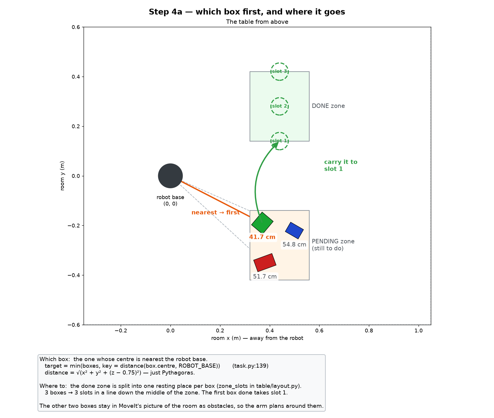
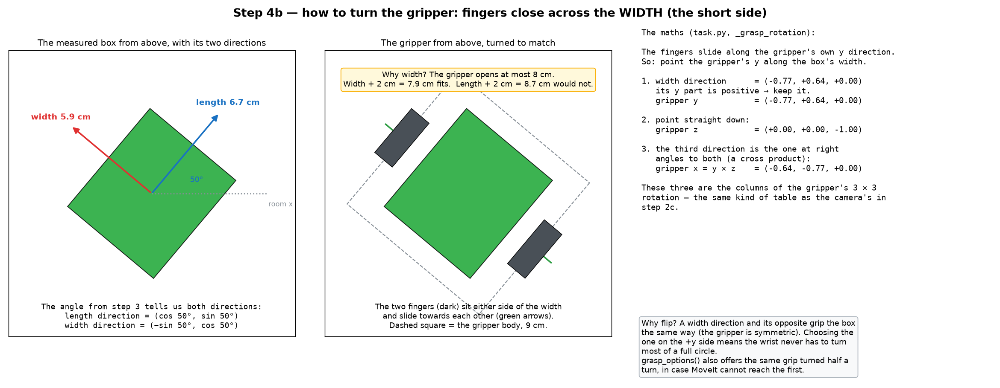
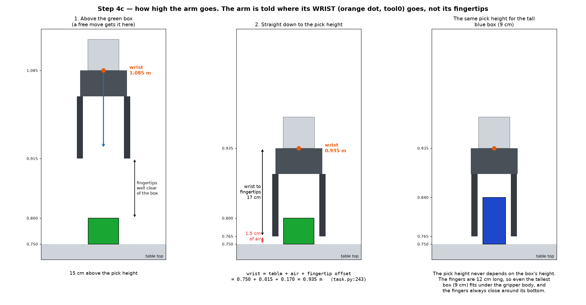
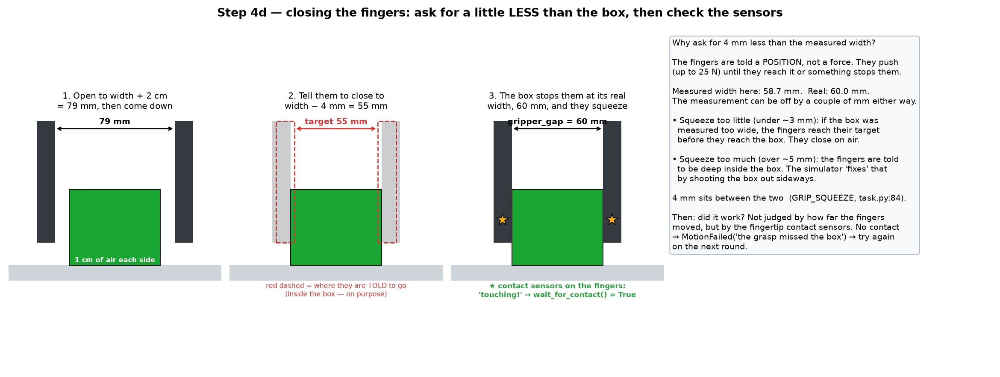
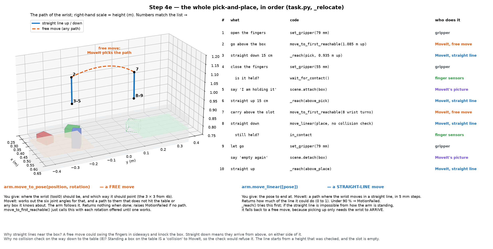

# Step 4: picking a box up and moving it

Step 3 gave us a list of measured boxes on the pending side. Step 4 picks the
nearest one and carries it to the done side. The order of things is in
`run()` in `task.py`, and the pick and place itself is `_relocate()`.

MoveIt does the planning of the arm's joints. This doc does not go into how.
It only says what each MoveIt call is given and what it gives back.

The pictures use the boxes measured in step 3 and the project's own numbers.
The box being picked is the green one.

## 1. Which box first, and where it goes



**Which box.** The one whose centre is nearest the robot base
(`task.py:139`). It is just Pythagoras:

```
distance = √(x² + y² + (z − 0.75)²)

green  41.7 cm   ← nearest, so first
red    51.7 cm
blue   54.8 cm
```

**Where it goes.** The done zone is split into one resting place, or slot,
per box. This is `zone_slots()` in `table/layout.py:38`. It runs once, after
the first look at the table, with the number of boxes found. The done zone is
the rectangle x = 0.32 to 0.56, y = 0.14 to 0.42.

1. Up to 3 boxes go in 1 column. With 4 or more, they go in 2 columns, because
   one line would put them closer together than a box is wide.
2. Rows = number of boxes ÷ columns, rounded up.
3. Spread them evenly (`_spread`). One item goes in the middle. Several go
   from one edge to the other, edges included:
   `position = low + (high − low) × index / (count − 1)`.

For 3 boxes: 1 column, so x = 0.44 (the middle). 3 rows, so y = 0.14, 0.28,
0.42. The first box done takes slot 1.

Before the arm moves, the other two boxes are given to MoveIt as obstacles
(`task.py:146`), so it plans its path around them.

## 2. How to turn the gripper



The fingers close across the box's **width**, its short side. The gripper
opens at most 8 cm. For the green box, width + 2 cm = 7.9 cm fits, but
length + 2 cm = 8.7 cm would not.

There is no "can the gripper take this?" check. The code always grips across
the width, and the spawner makes sure there is no need: it only makes boxes
whose width is at most 6.5 cm (`MAX_GRASP_WIDTH`). The opening is also capped at
8 cm, the most the gripper can open.

The fingers slide along the gripper's own **y direction**. So the maths
(`_grasp_rotation`, `task.py:342`) is "point the gripper's y along the box's
width". The box's angle from step 3 is 50°:

```
1. width direction = (−sin 50°, cos 50°, 0) = (−0.77, +0.64, 0)
   its y part is positive, so keep it          → gripper y
2. point straight down                          → gripper z = (0, 0, −1)
3. the direction at right angles to both        → gripper x = y × z = (−0.64, −0.77, 0)
```

These three directions are the gripper's 3 × 3 rotation. It is the same kind
of table as the camera's in step 1. With it, the two fingers sit along the
two long sides of the box, one on each side.


## 3. How high the arm goes



The arm is always told where its **wrist** (tool0) goes, not its fingertips.
The fingertips are 17 cm below the wrist, because the gripper points down.
This is the same idea as the camera offset in step 1.

```
wrist height = table + air under the fingertips + fingertip offset
             = 0.750 + 0.015 + 0.170 = 0.935 m          (task.py:243)
above it     = 0.935 + 0.15          = 1.085 m
```

The arm first goes to 1.085 m, above the box, then straight down to 0.935 m.
That leaves 1.5 cm of air under the fingertips.

The pick height does not depend on the box's height. The fingers are 12 cm
long, so even a 9 cm box fits under the gripper body, and the fingers always
close around the bottom of the box.

## 4. Closing the fingers



1. **Open** to width + 2 cm (79 mm), which leaves 1 cm of air each side.
   Then come down.
2. **Close**, telling the fingers to go to width − 4 mm (55 mm). That target
   is inside the box, on purpose.
3. The box stops the fingers at its real width (60 mm), and they squeeze.

**Why 4 mm less?** The fingers are given a position, not a force. They push
until they get there or something stops them. The measured width can be off by
a couple of millimetres:

- told the exact measured width, on a box measured 2 mm too wide, they stop
  2 mm short and close on air;
- told much less (over about 5 mm), they are asked to be deep inside the box,
  and the simulator "solves" that by shooting the box out sideways.

4 mm sits between the two (`GRIP_SQUEEZE`, `task.py:84`).

**Did it work?** This is checked with the fingertip contact sensors
(`wait_for_contact()`, `task.py:258`), not with how far the fingers moved. If
they feel nothing, the grasp missed, and the code raises `MotionFailed`.

## 5. The whole sequence



| # | What | Code | Who does it |
| --- | --- | --- | --- |
| 1 | open the fingers | `set_gripper(79 mm)` | gripper |
| 2 | go above the box | `move_to_first_reachable(...)` | MoveIt, free move |
| 3 | straight down 15 cm | `_reach(pick)` | MoveIt, straight line |
| 4 | close, and check it is held | `set_gripper(55 mm)`, `wait_for_contact()` | gripper, sensors |
| 5 | "I am holding it" | `scene.attach(box)` | MoveIt's picture of the room |
| 6 | straight up 15 cm | `_reach(above_pick)` | MoveIt, straight line |
| 7 | carry it above the slot | `move_to_first_reachable(8 wrist turns)` | MoveIt, free move |
| 8 | straight down, and check it is still held | `move_linear(place)`, `in_contact` | MoveIt, sensors |
| 9 | let go, then "empty again" | `set_gripper(79 mm)`, `scene.detach(box)` | gripper, MoveIt's picture |
| 10 | straight up | `_reach(above_place)` | MoveIt, straight line |

**The MoveIt calls, in one line each.**

- `move_to_pose(position, rotation)` is a free move. You give where the wrist
  should be and which way it should point. MoveIt finds joint angles and a path
  that hits nothing it knows about, and the arm follows it. If there is no
  path, it raises `MotionFailed`. `move_to_first_reachable()` just tries each
  rotation it is given until one works.
- `move_linear([pose])` is a straight-line move. MoveIt makes the wrist travel
  in a straight line, in 5 mm steps, and returns how much of the line it
  managed, from 0 to 1. Less than 90 % counts as a failure. `_reach()` tries
  this first, and falls back to a free move if the straight line is
  impossible, because picking up only needs the wrist to arrive.
- `scene.attach()` and `scene.detach()` tell MoveIt the box is now part of
  the gripper, and then that it is not. While it is attached, MoveIt plans the
  carry with the box included, so it does not sweep it through the other
  boxes.

**Why straight lines near the box?** A free move could swing the fingers in
from the side and knock the box over. Straight down means they arrive from
above, one on each side.

**Why is step 8 not collision-checked?** To MoveIt, standing a box on the
table counts as a collision, so it would refuse the move
(`avoid_collisions=False`, `task.py:275`). The line starts from a height that
was checked, and the slot is empty.

In step 7 the wrist may turn any of 8 ways, every 45°. It does not matter
which way round the box lands, because it is measured again next.

## What comes out of step 4

The box sits in its slot on the done side, and the gripper is open and empty
above it.

If anything fails on the way, `MotionFailed` is caught in `run()`, the
gripper opens, and the run moves on. The pending side is looked at again at
the start of every round (`task.py:135`), so a box the arm missed is simply
tried again on a later round. The number of tries is capped at twice the
number of slots, so a box the arm cannot manage is not tried forever.

Step 5 measures the moved box again, closer up.
