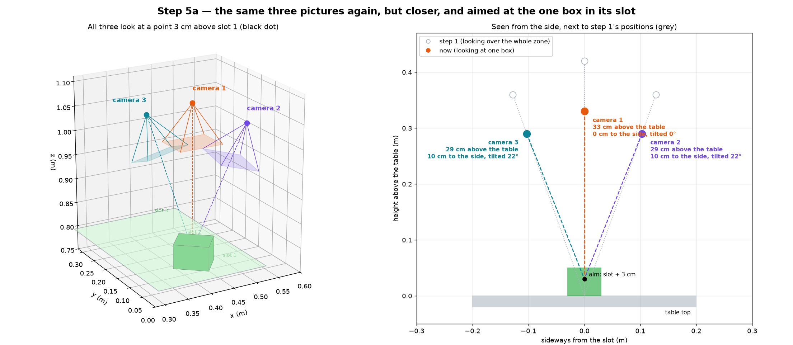
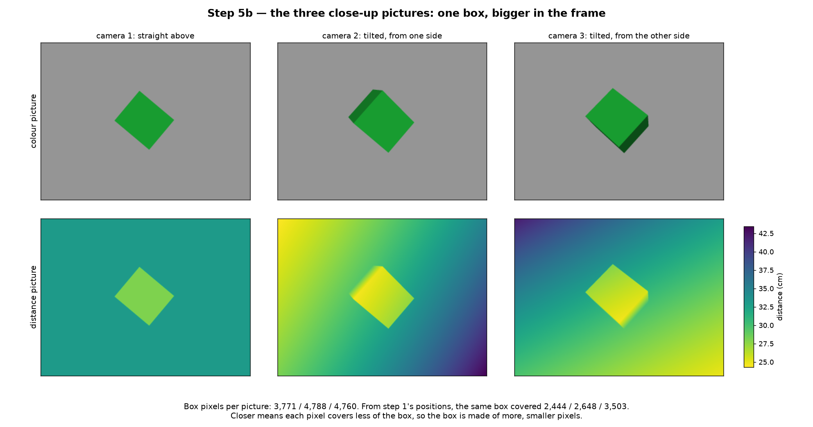
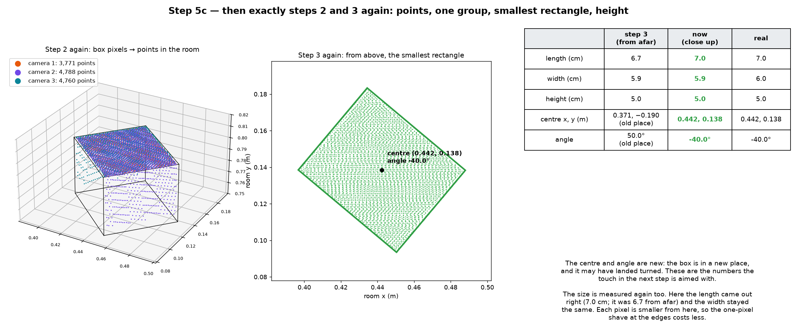
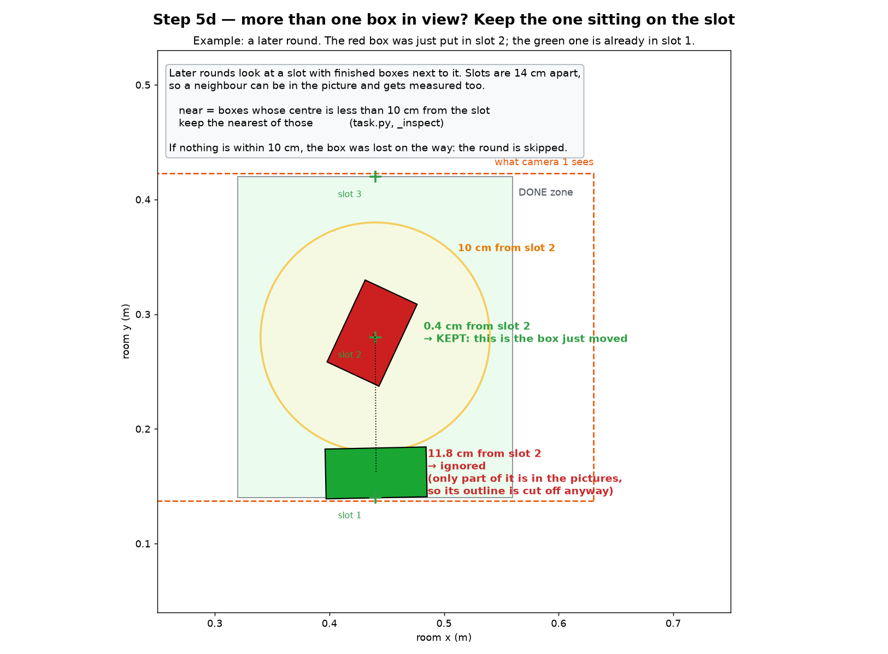

# Step 5: measuring the moved box again, close up

The box now sits in its slot on the done side. Before touching it, the arm
looks at it again and measures it again. This is `_inspect()` in `task.py`,
and it is mostly steps 1 to 3 over again:

```python
found = self._look(slot + UP * 0.03, INSPECT_OFFSETS)                  # steps 1–3 again
near  = [box for box in found if distance(box.centre, slot) < 0.10]    # boxes on the slot
return  the nearest of near, or None
```

The pictures use the green box from step 4, now in slot 1.

## 1. Where the camera goes



It is the same idea as step 1, with two changes.

**It aims at the slot, not at the middle of the zone.** The aim point is the
slot, 3 cm up: (0.44, 0.14, 0.78) for slot 1. 3 cm is about the middle height
of a box, since boxes are 4 to 9 cm tall.

**It is closer.** The offsets are `INSPECT_OFFSETS` in `task.py`:

| Camera | Step 1 (whole zone) | Now (one box) |
| --- | --- | --- |
| 1 | 42 cm above the table, straight down | 33 cm above the table, straight down |
| 2 | 36 cm up, 13 cm to the side, tilted 20° | 29 cm up, 10 cm to the side, tilted 22° |
| 3 | the same, on the other side | the same, on the other side |

Everything else is as in step 1. The looking direction is `-offset`. The
wrist goes 8.5 cm to the side of the camera spot. Up to 6 spin angles are
tried, and a position the arm cannot reach is skipped.

## 2. The three pictures



One box, bigger in the frame. The green box now covers 3,771, 4,788 and 4,760
pixels in the three pictures. From step 1's positions it covered 2,444, 2,648
and 3,503. From 33 cm up, one pixel is about 1.2 mm of table, against 1.5 mm
before.

## 3. Then steps 2 and 3, unchanged



Find the colourful pixels, shave the edge, turn the pixels into room points,
group them, and find the height and the smallest rectangle. No new maths.

| | Step 3 (from afar) | Now (close up) | Real |
| --- | --- | --- | --- |
| length | 6.7 cm | 7.0 cm | 7.0 cm |
| width | 5.9 cm | 5.9 cm | 6.0 cm |
| height | 5.0 cm | 5.0 cm | 5.0 cm |
| centre x, y | 0.371, −0.190 (old place) | 0.442, 0.138 | 0.442, 0.138 |
| angle | 50° (old place) | −40° | −40° |

**Why measure again?**

1. **The box is somewhere new, and may be turned.** When the box was put
   down, the wrist may have turned in steps of 45°. In this example the box
   landed at −40° instead of 50°, and a few millimetres off the slot centre.
   The touch in step 6 is aimed with these new numbers.
2. **Closer means smaller pixels,** so the one-pixel shave at the edges costs
   less. Here the length came out right, 7.0 cm instead of 6.7. The width
   stayed the same.
3. **The box is on its own,** so no other box hides part of it.

## 4. Which box is ours?



In later rounds, finished boxes sit next to the slot being looked at. Slots
are 14 cm apart, so a neighbour can be in the picture, and it gets measured
too. So the code keeps only boxes whose centre is less than 10 cm from the
slot, and takes the nearest of those.

In the example, the red box was just put in slot 2. It is 0.4 cm from the
slot, so it is kept. The green box in slot 1 is 11.8 cm away, so it is
ignored. It was only partly in the pictures anyway, so its outline was cut
off.

If nothing is within 10 cm, the box was lost on the way. The code logs
"lost track of the cuboid" and skips the rest of this round.

## What comes out of step 5

One freshly measured `Cuboid`: centre, angle, and length, width and height.

It is given to MoveIt as an obstacle (`_publish`, `task.py:156`), so the arm
plans around this box when it goes to touch it.

Step 6 picks the face to touch and touches it.
