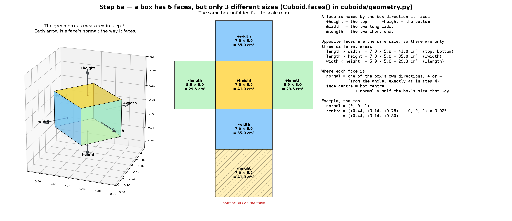
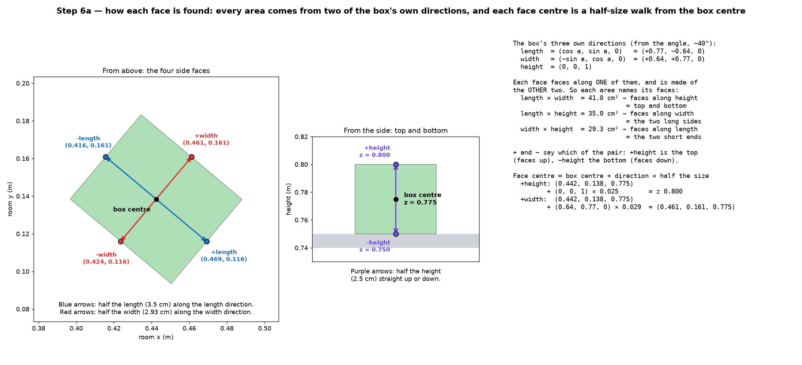
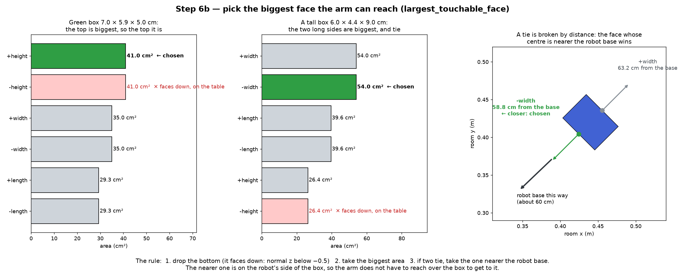
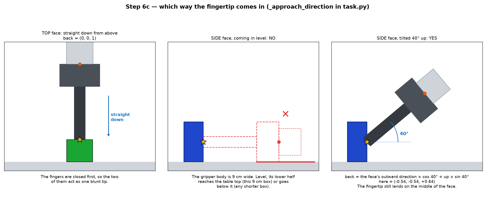
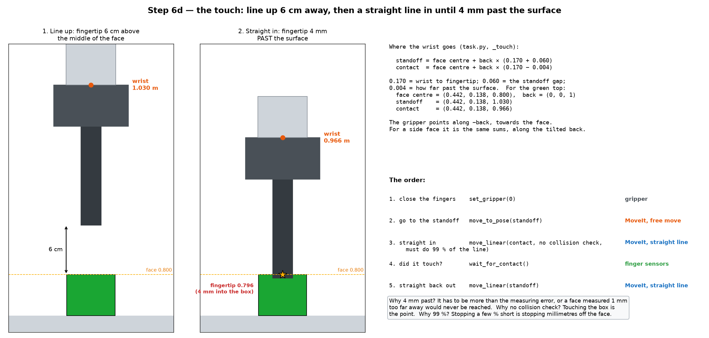

# Step 6: choosing a face and touching it

Step 5 gave us a freshly measured box: centre, angle, length, width and
height. Step 6 works out its six faces, picks the biggest one the arm can
reach, and presses the fingertip into the middle of it. Three pieces of code
do this:

- `Cuboid.faces()` in `cuboids/geometry.py` lists the six faces;
- `largest_touchable_face()` in the same file picks one;
- `_touch()` in `task.py` touches it.

The pictures use the green box as measured in step 5, and a tall made-up box
for the case where a side face wins.

## 1. Six faces, three sizes



Step 5 measured only five things: the box's **centre**, its **angle**, and its
**length, width and height**. Everything about the faces is worked out from
these five, in `Cuboid.faces()`.

### The box's three own directions

From the angle `a` we get three directions that belong to the box. They are
the same ones used for the grasp in step 4:

```
length direction = (cos a,  sin a, 0)    along the long side, on the table
width direction  = (−sin a, cos a, 0)    along the short side, on the table
height direction = (0, 0, 1)             straight up
```

For the green box, `a = −40°`:

```
length direction = (+0.77, −0.64, 0)
width direction  = (+0.64, +0.77, 0)
height direction = (0, 0, 1)
```

The length is measured along the length direction, the width along the width
direction, and the height along the height direction.

### Each area already knows which faces it belongs to

Every face points along one of the three directions and is made of the other
two. The top points along height, and its edges run along length and width.
So its area is length × width. That is why there is never a question of
"is this 41 cm² face the top or a side?". The area is calculated *from* a
pair of directions, so the pair says which faces it is:

| Area | Faces point along | Which faces | Green box |
| --- | --- | --- | --- |
| length × width | height | top and bottom (`±height`) | 7.0 × 5.9 = 41.0 cm² |
| length × height | width | the two long sides (`±width`) | 7.0 × 5.0 = 35.0 cm² |
| width × height | length | the two short ends (`±length`) | 5.9 × 5.0 = 29.3 cm² |

Each area belongs to two opposite faces. `+` and `−` say which of the pair:
`+height` points up and is the top, `−height` points down and is the bottom.
The direction a face points is called its **normal**:
`normal = + or − that direction`.

### From the box centre to each face centre



Step 5 gave the centre of the box, not of its faces. To get to the middle of a
face, start at the box centre and walk half the box's size along that face's
normal (`geometry.py:71-72`):

```
face centre = box centre + normal × (size along that direction) / 2
```

The top is half the height up. A long side is half the width sideways, along
the width direction. A short end is half the length along the length
direction. For the green box, with centre (0.442, 0.138, 0.775):

| Face | Normal | Walk | Face centre |
| --- | --- | --- | --- |
| `+height` (top) | (0, 0, +1) | half the height, 2.5 cm | (0.442, 0.138, 0.800) |
| `−height` (bottom) | (0, 0, −1) | 2.5 cm | (0.442, 0.138, 0.750) |
| `+width` | (+0.64, +0.77, 0) | half the width, 2.9 cm | (0.461, 0.161, 0.775) |
| `−width` | (−0.64, −0.77, 0) | 2.9 cm | (0.424, 0.116, 0.775) |
| `+length` | (+0.77, −0.64, 0) | half the length, 3.5 cm | (0.469, 0.116, 0.775) |
| `−length` | (−0.77, +0.64, 0) | 3.5 cm | (0.416, 0.161, 0.775) |

Worked out for the top and for one long side:

```
top:     (0.442, 0.138, 0.775) + (0, 0, 1)       × 0.025  = (0.442, 0.138, 0.800)
+width:  (0.442, 0.138, 0.775) + (0.64, 0.77, 0) × 0.029  = (0.461, 0.161, 0.775)
```

The side faces' centres stay at the box's middle height (0.775), because
their normals point sideways. The top's centre stays at the box's middle in x
and y, because its normal points straight up.

So each face ends up with three things: its area, its centre (where to
touch), and its normal (which way it faces). Section 2 uses the area to pick
one. Sections 3 and 4 use the centre and the normal to touch it.

## 2. Choosing the face



The rule has three steps:

1. **Drop the bottom.** It sits on the table, and the arm cannot get under it.
   In code, any face whose normal points down (normal z below −0.5) is
   dropped.
2. **Take the biggest area.**
3. **If two faces tie, take the one whose centre is nearer the robot base.**

For the green box, the top is biggest (41.0 cm²), so the top it is.

For a tall box (6.0 × 4.4 × 9.0 cm), the two long sides are biggest
(54.0 cm² each) and tie. The one 58.8 cm from the robot base beats the one
63.2 cm away. The nearer face is on the robot's side of the box, so the arm
does not have to reach over the box to get to it.

## 3. Which way the fingertip comes in



This is `_approach_direction()` in `task.py`. It gives a direction called
`back`, which points from the face centre back towards where the wrist will
be.

- **A top face:** straight down from above. `back = (0, 0, 1)`.
- **A side face:** from outside the face, tilted 40° up.
  `back = the face's outward direction × cos 40° + up × sin 40°`.

Why not come in level at a side face? The gripper body is 9 cm wide. Coming
in level, its lower half would reach the table top for a 9 cm box, and go below
it for any shorter box. Tilting 40° up keeps it clear. The fingertip still
lands on the middle of the face.

Before touching, the fingers are closed, so the two of them act as one blunt
tip. The gripper is turned to point along `−back`, towards the face.

## 4. The touch



The wrist goes to two places along the `back` line (`_touch()`, `task.py`):

```
standoff = face centre + back × (0.170 + 0.060)    fingertip 6 cm from the face
contact  = face centre + back × (0.170 − 0.004)    fingertip 4 mm past the surface
```

0.170 m is the distance from the wrist to the fingertip, the same number as in
step 4. For the top of the green box, `back = (0, 0, 1)`:

```
face centre = (0.442, 0.138, 0.800)
standoff    = (0.442, 0.138, 1.030)
contact     = (0.442, 0.138, 0.966)    the fingertip is at 0.796, 4 mm into the box
```

For a side face it is the same sums, along the tilted `back`.

The order:

| # | What | Code | Who does it |
| --- | --- | --- | --- |
| 1 | close the fingers | `set_gripper(0)` | gripper |
| 2 | go to the standoff | `move_to_pose(standoff)` | MoveIt, free move |
| 3 | straight in | `move_linear(contact)` | MoveIt, straight line |
| 4 | did it touch? | `wait_for_contact()` | fingertip sensors |
| 5 | straight back out | `move_linear(standoff)` | MoveIt, straight line |

Three choices in this, and why:

- **4 mm past the surface.** The target has to be deeper than the measuring
  error. Otherwise a face measured 1 mm too far away would never be reached.
- **No collision check on the way in.** Touching the box is the point, and
  MoveIt would refuse a move that touches it. The line starts from a standoff
  that was reached with checking, so it cannot hit anything else.
- **The whole line must be done (99 %).** Stopping a few per cent short means
  stopping millimetres off the face, which is the difference between touching
  it and hovering next to it.

Whether it touched is read from the fingertip contact sensors, not from where
the arm thinks it went.

## The end of a round, and of the run

The box, its chosen face, and whether it was touched are saved as one result.
A face the arm reached but did not feel is still saved, with "no contact"
logged.

Then the next round starts: look at the pending side again (step 1), take the
nearest box, and so on. When the pending side is empty, or the tries run out,
the arm looks one last time and reports any box still left there. Then it parks
above the pending zone and prints the summary.
