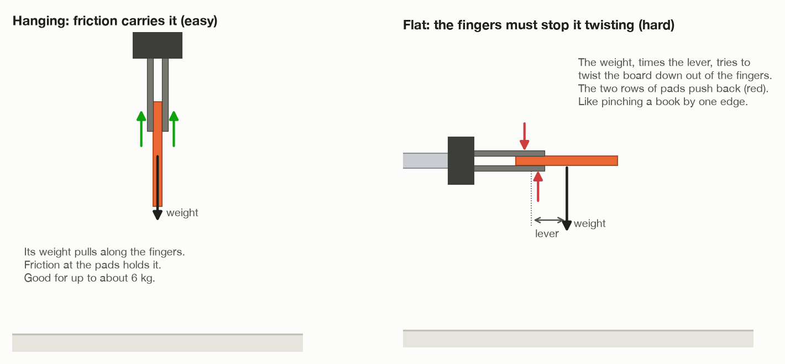
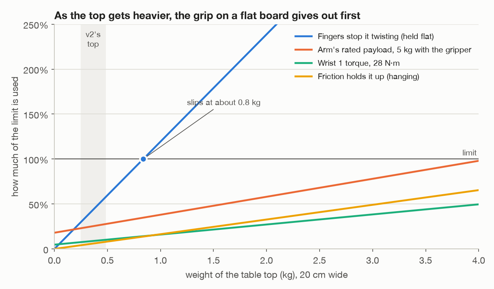
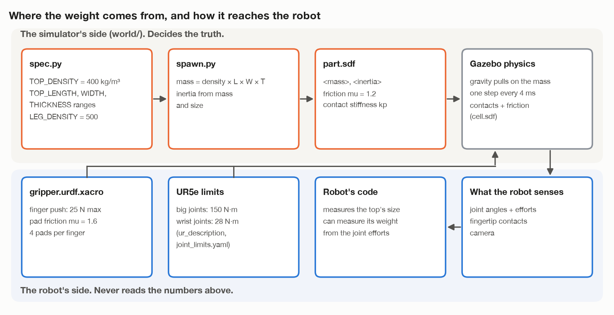

# The swing: who moves, and how heavy a top it can take

This goes with [`TOP_FROM_WALL.md`](TOP_FROM_WALL.md), way A: grip the top by
its upper edge, let it hang, and swing it flat in the air. It answers two
questions:

1. During the swing, does only the gripper move, or the whole arm?
2. What stops this working when the top is heavy, and how do you test that in
   Gazebo?

Numbers are v2's: its gripper, its arm, its table top. File names are v2's
too.

---

## 1. Who moves during the swing?

**The gripper cannot turn anything by itself.** It only opens and closes its
fingers. Every turn and every move comes from the arm's six joints. The last
three, the wrist joints, are the ones next to the gripper.

So the real question is: do all six joints move, or only one wrist joint?
Both work. They are different moves.


**Way 1: the whole arm moves** (this is what `TOP_FROM_WALL.md` describes).
The gripped edge stays in one place and the board turns about it. Wrist 1 does
most of the turning, the full 90 degrees. But wrist 1 sits about 20 cm back
from the fingers, so turning it alone would move the fingers too. The shoulder
and elbow move a little at the same time to keep the fingers where they are.
You give MoveIt the list of tool poses (`move_linear()` in v2), and it works
out all six joints.

- Good: the board only needs as much empty space as its own size, about 20 cm.
- Bad: MoveIt has to follow a path in space, and that can stop short (v2's
  legs saw it stop at 96%).

**Way 2: only the wrist turns.** Wrist 1 turns 90 degrees and every other
joint stands still. It is the simplest move a robot arm can make: one joint,
from one angle to another.

- Good: nothing to work out, nothing to stop short, and easy to keep slow and
  smooth.
- Bad: the board turns about the wrist, not about its own edge. Its far edge
  swings round a circle about 40 cm across, so it needs twice the empty space.
  The board also ends up somewhere else, but that does not matter, because the
  next move carries it anyway.

**Which one?** For the grip, it makes no difference. How hard the board pulls
on the fingers depends only on its angle and how fast it turns (section 2),
not on which joints do the turning. So choose by space. **Try way 2 first**,
high up where nothing is within 40 cm. Use way 1 where there is less room.

**The carry round the base**, before and after the swing, is mostly the base
joint turning. The shoulder and elbow adjust how far out and how high the part
is, and wrist 3 turns the gripper about the vertical so the gripped edge ends
square to the arm.

| Stage | Joints that move most |
| --- | --- |
| Lift and pull back off the wall | shoulder, elbow |
| Straighten (about 20°) | wrist 1, plus shoulder and elbow in way 1 |
| Carry round, hanging | base, plus wrist 3 to turn the board |
| Swing flat (90°) | wrist 1, plus shoulder and elbow in way 1 |
| Carry round, flat | base, plus wrist 3 |
| Lower onto the legs | shoulder, elbow, wrist 1 |

---

## 2. What the weight does

Try this with a notebook. Pinch it by one edge and let it hang: easy. Now
hold it flat, still pinched by that one edge: much harder. Try the same with
a heavy dictionary: you cannot. A person would not even try. They would use
two hands, or rest one end on the table first.

The robot has the same problem.



The board's weight asks three things of the robot:

1. **Don't let it slide out.** Hanging, the weight pulls along the fingers.
   Friction at the pads holds it. Friction can be at most the squeeze times
   the friction number (μ), on each finger.
2. **Don't let it twist out.** Held flat, the weight sits out beyond the
   fingers. Weight times that distance (the *lever*) is a twisting pull. The
   two rows of pads on each finger push back against it, and how hard they can
   push depends on the squeeze and on how far apart the rows are.
3. **Hold the arm up.** The weight and its lever also load the arm's joints,
   most of all the wrist, which is closest.

Moving adds to all three. When the arm speeds up or slows down, the board
pushes back on the fingers. Keep the swing slow and smooth. v2 carries every
part at a tenth of full speed for this reason.

The chart in `TOP_FROM_WALL.md` shows how the twist grows through the swing.
It is zero when hanging and largest when flat.

---

## 3. The numbers

With v2's gripper and arm, for a top 20 cm wide:

| Limit | What decides it | v2's value | Heaviest top it allows |
| --- | --- | --- | --- |
| Slide out, hanging | 2 fingers × μ × squeeze | 2 × 1.2 × 25 N = 60 N | about 6 kg |
| Twist out, flat | squeeze × distance between pad rows | 25 N × 2.4 cm ≈ 0.6 N·m | **about 0.8 kg** |
| Wrist 1 strength | the wrist's torque limit | 28 N·m | about 8.5 kg |
| Arm's payload | UR's rating, including the 0.9 kg gripper | 5 kg | about 4 kg |

The squeeze (25 N) and the pad friction are in `gripper.urdf.xacro`; the part's
friction (1.2) is in `world/part.sdf`; the wrist's limit is in
`ur_description/config/ur5e/joint_limits.yaml`. The twist limit is a rough
estimate: the real one also depends on how the simulator handles the contact
at each pad. The test in section 5 gives the true answer.

The arm's payload is the rating for a load close to the flange. The top's
weight sits 30 cm out, and UR's payload chart allows less there. Check that
chart before trusting the 4 kg.



What this means:

- **The twist on a flat board gives out first**, long before the arm itself
  struggles. That is the weak point of way A.
- v2's top weighs 0.25 to 0.48 kg. That uses 30 to 57% of the twist limit. It
  works, but without much to spare.
- A heavier top does not fail all at once. It slips part way through the
  swing, at the angle where the twist first gets too big:

  | Top's weight | Where in the swing it slips (0° = hanging, 90° = flat) |
  | --- | --- |
  | 0.48 kg (v2's heaviest) | does not slip |
  | 1.0 kg | at about 57° |
  | 1.5 kg | at about 34° |
  | 2.4 kg | at about 20° |

- A real table top, say 60 × 40 × 1.8 cm of MDF, weighs about 3.2 kg. Held
  flat by one edge it needs a twist of about 5.5 N·m, nine times what the
  fingers can give. **Way A is for light tops only.**

How the limit could be raised, most useful first:

1. **Let something else carry part of the weight.** Rest one edge on the legs
   and tilt it down, as a person would. See [`TILT_ON_LEGS.md`](TILT_ON_LEGS.md).
2. **Grip the middle, not the edge.** A suction cup on the middle of the face
   (way B in `TOP_FROM_WALL.md`) has almost no lever.
3. **Spread the pads further apart.** The twist limit grows in step with the
   distance between the rows: 10 cm apart instead of 2.4 is four times more.
4. **Squeeze harder.** The twist limit grows in step with the squeeze. Real
   grippers go up to about 200 N.

---

## 4. Weight in Gazebo: how the dots connect

Gazebo has no idea of "heavy". It only knows, for each object, a **mass** and
how that mass is spread out (the **inertia**). Everything else follows from
that, step by step.



On the simulator's side:

1. `world/spec.py` sets the top's density (`TOP_DENSITY = 400` kg/m³, about
   poplar plywood) and the ranges its size is drawn from.
2. `world/spawn.py` works out the mass: density × length × width × thickness.
   From the mass and the size it works out the inertia too.
3. `world/part.sdf` carries both into the world file, along with the
   friction number (μ = 1.2) and how stiff a contact is.
4. **Gazebo's physics** runs in steps of 4 ms (`world/cell.sdf`). In every
   step, gravity pulls on each mass. Where two shapes touch, Gazebo pushes
   them apart, and allows friction up to μ times that push.

On the robot's side:

5. `arm/gripper.urdf.xacro` gives each finger a limit: it pushes with at most
   25 N. The pads have μ = 1.6.
6. The UR5e's joint limits (150 N·m for the big joints, 28 N·m for the wrist
   joints) cap how hard each joint can push.
7. The robot senses what happens: joint angles and efforts (on
   `/joint_states`), the fingertip contact sensors, and the camera.

When the board needs more friction, or more twist, than the fingers can give,
Gazebo lets it slide. That is the same as in real life, only more sudden.
The fingertip contact sensors then stop feeling the board, and v2's task
stops with "the top slipped out of the gripper".

**The robot never reads the mass.** That would break the project's one rule.
If it needs to know the weight, it has to measure it. It can: read the wrist
joints' efforts just before and just after lifting the top. The difference,
divided by the lever, is the top's weight. Then it can choose: light enough,
swing it; too heavy, rest it on the legs; far too heavy, stop and say so.

---

## 5. How to make the top heavier for a test

Change `TOP_DENSITY` in `world/spec.py`. The mass goes up in step with it, and
the inertia follows by itself, because `spawn.py` works it out from the mass.
Do this in a copy for v3, not in the working v2.

For the largest top (30 × 20 × 2 cm):

| `TOP_DENSITY` (kg/m³) | Mass | What should happen with way A |
| --- | --- | --- |
| 400 (v2 now) | 0.48 kg | works |
| 700 | 0.84 kg | right at the limit: may slip near flat |
| 1000 | 1.2 kg | slips around halfway through the swing |
| 2000 | 2.4 kg | slips early, about 20° into the swing |

2000 kg/m³ is not a real wood. It is a way of testing a heavy top without
making it bigger. Making it bigger also works, but the top must still fit the
gripper (at most 6.5 cm thick) and the arm's reach.

While it runs, watch:

```
ros2 topic echo /joint_states          # the wrist joints' efforts go up as the top swings flat
gz model -m table_top -p               # where the top really is, from the simulator
```

If the predictions in the table hold, the numbers in section 3 are right. If
the top slips earlier, the simulated pads hold less than the estimate, and way
A's real limit is lower still.
