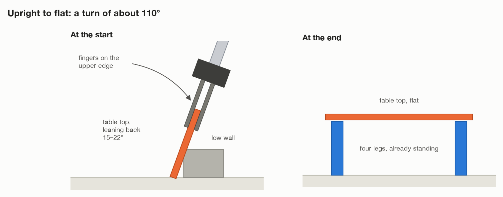
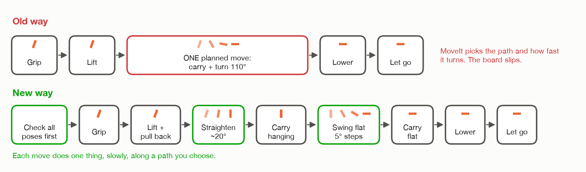
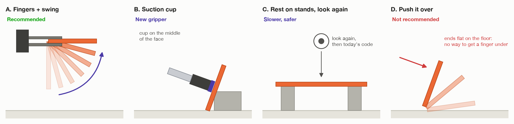
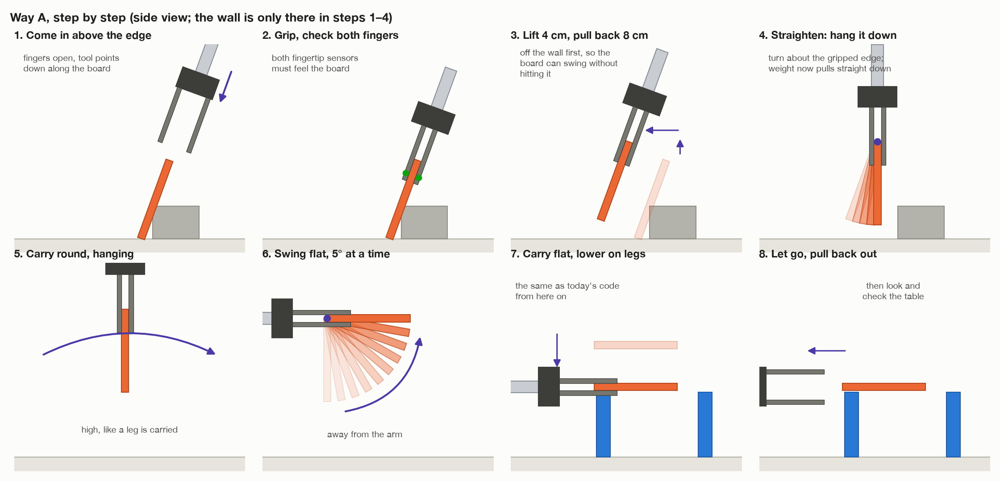
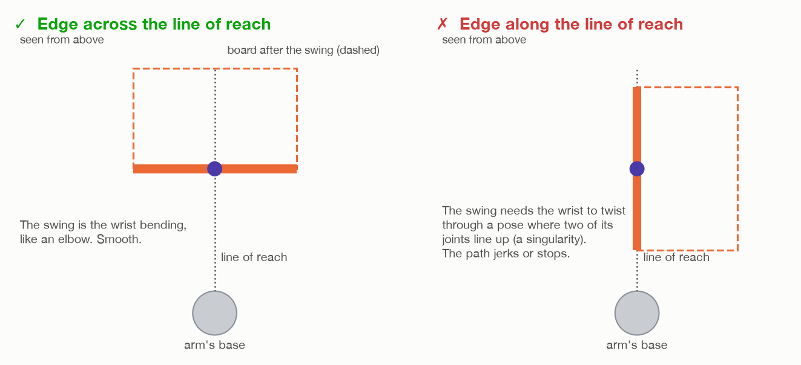
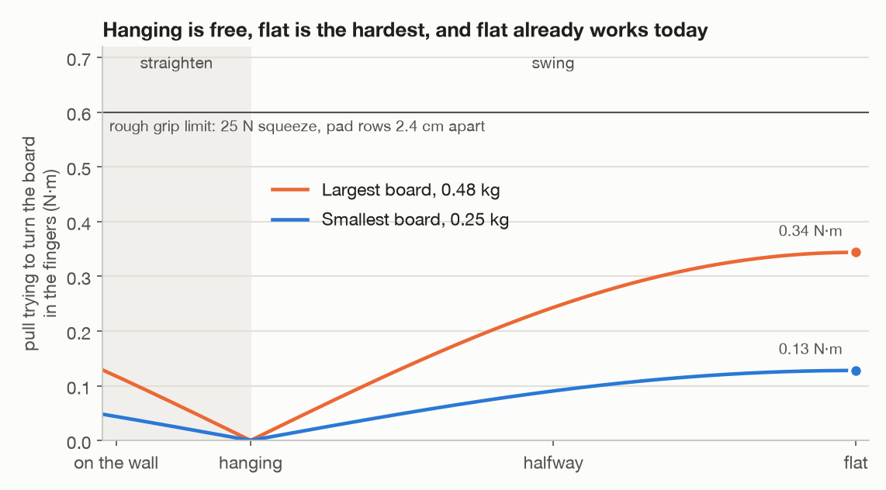

# Picking the top up from a wall

This is a plan, not code. None of it is built yet. It covers the first
version of the job, the one that kept failing: the table top starts **leaning
against a wall**, and the arm has to pick it up, turn it flat, and lay it on the
four legs.

The working version, in [`../v2`](../v2), starts the top lying flat on two
grey stands, so the arm never has to turn it. This file explains how to add
the turn back. File and function names in it (`task.py`, `carry_round()`, and
so on) are v2's.

Two related files:

- [`SWING_PHYSICS.md`](SWING_PHYSICS.md): which joints move during the swing,
  and how heavy a top this way can handle.
- [`TILT_ON_LEGS.md`](TILT_ON_LEGS.md): the other way, the way a person would
  do it. Rest one edge on two legs, then tilt the top down.

It uses the same words as the rest of the docs. If a word is new to you, look
in [Words used here](#words-used-here) at the end.

The pictures are sketches, not to scale. They are drawn by
[`figures/top_from_wall.py`](figures/top_from_wall.py). See the
[README](README.md) for how to redraw them.

---

## 1. The problem in one picture



So the top has to go from **nearly upright** to **flat**. That is a turn of
about 105 to 112 degrees: 90 degrees, plus the 15 to 22 degrees it leans.

Everything else stays the same as the working version: finding the room,
measuring the top, planning the table, and standing the four legs.

---

## 2. Why the old version kept failing

I did not run the old version for this file. These reasons come from reading
its code (commit `c54165c`, `task.py` `_install_top()`) and its own notes.

1. **The whole turn was one planned move.** After the lift, one call to
   `move_to_first(level_top_poses(...))` asked MoveIt to go from "board hanging
   from its edge" straight to "board flat over the legs". MoveIt's planner (OMPL)
   picks its own path for that. It can swing the wrist fast and far. The board
   is held by friction only, so it slips or falls. The old notes say the same
   thing happened to the legs ("a turn folded into one long planned move ...
   flings a part held only by friction"). The legs got a slow turn in small
   steps. The top never did.
2. **Nothing was checked before the grip.** The arm gripped the board first and
   found out later if it could reach the flat pose. Some grips need the wrist
   flipped the other way at the end. With a part in hand, a wrist flip is not
   allowed, so the move was refused with the board already in the air. The
   current code checks this first, but only for the final pose.
3. **Tight room behind the board.** The finger behind the board had to pass
   above the wall, and the old test only asked for 1 cm to spare. In a room
   near that limit, a small error in the measured lean is enough to touch the
   wall.
4. **The lift was not checked for collisions.** The board touches the floor
   and the wall at the start, so MoveIt would refuse any move. The lift
   therefore ran with collision checking off.

The fix is not a new library. It is to **split the turn into small, slow,
simple moves**, and to **check every one of them before touching the board**.



---

## 3. The ways it can be done



| | Way | Gripper | Good | Bad |
| --- | --- | --- | --- | --- |
| **A** | Grip the upper edge. Lift. Swing it flat in the air, slowly, in small steps. | The two-finger gripper you have now | Uses what already works. After the swing, the board is held exactly as it is in the working version, so the rest of the code can be reused. | The swing is the hard part. Needs room behind the board's upper edge for one finger. |
| **B** | Stick a suction cup on the middle of the board's face. Pull it off the wall. Turn the tool to point down, so the board is flat. Put it down from above. | A vacuum (suction) gripper | Holds the board at its middle, so its weight does not try to tip it. Put down from above and lifted straight off, like a leg. No need for room behind the board. Works against a tall wall too. | A new gripper. Gazebo has no real suction, so it has to be faked (see section 8). |
| **C** | Two stages: do A, but put the board flat on two stands first. Let go. Look at it with the camera. Then run today's working code. | Two-finger | Two small problems instead of one big one. The camera measures the board again after the swing, so any slip in the fingers is corrected. | Slower. Needs two stands in the room. Still needs the swing. |
| **D** | Push or tip the board over without gripping it. | Any | No grasp needed. | Hard to control. The board ends up flat on the floor, where the fingers cannot get under it. Not recommended. |

**Recommendation: A, with the current gripper.** It changes the least, and the
second half of it (carry flat, lower onto the legs, let go, pull out) already
works. If the board keeps slipping during the swing, move to **C** first (same
gripper, adds a check). Move to **B** only if you want a different gripper, or
if the wall has to be tall.

The rest of this file is mostly about A.

---

## 4. Way A, step by step

This is the order of things, in plain words. Steps marked **(exists)** are
already done by today's code and can stay as they are.



1. **Look round the room** (exists). Find the floor, the top, the legs, and the
   wall. The wall is grey, so it is an obstacle. It goes into MoveIt's picture
   of the room.
2. **Measure the top up close** (exists, mostly). The fitting code
   (`fit_plate()`) already fits a board at any angle. From it, get the top's
   length, width, thickness, **how far it leans**, and **which long edge is the
   highest**. That highest edge is the one to grip.
3. **Plan the table** (exists). The gripped edge becomes the near edge of the
   table, facing the arm. Its long edge faces the arm, as now.
4. **Stand the four legs** (exists).
5. **Plan the whole top move before touching the board.** Work out every pose
   the tool will pass through, from the first approach to the last pull-out.
   Check that the arm can reach every one, without hitting anything, and
   **with the wrist the same way round the whole time**. If no grip passes,
   stop here, and say why. Nothing has moved yet.
6. **Come in above the upper edge.** Open the fingers. Line up a few
   centimetres above the edge, with the tool pointing down along the board's
   face. Move straight down the face until the fingers are 5 cm over the edge.
7. **Grip.** Close the fingers. Check both fingertip sensors feel the board.
8. **Tell MoveIt the board is now part of the arm** (`scene.attach()`). From
   now on it plans for the board as well.
9. **Lift it straight up**, slowly, 3 to 4 cm. The lower edge leaves the floor
   and the face moves away from the wall's corner. Collision checking has to
   be off here, because the board starts off touching the floor and the wall.
   This is the only move without it, and it is short. Then **pull it back
   8 cm towards the arm**, with collision checking on. Straightening swings
   the lower edge away from the arm by up to 7.5 cm (20 cm × sin 22°).
   Straightened right after the lift, it would swing into the wall.
10. **Straighten it.** Turn the tool about the gripped edge, slowly, until the
    board hangs straight down. That is a turn of 15 to 22 degrees. Hanging
    straight down is the safest way to hold it: its weight pulls straight
    along the fingers and does not try to turn it.
11. **Carry it round, hanging**, to a clear place in the air. Use
    `carry_round()`, exactly as for a leg. The board is just a wide, flat leg
    here. Carry it high enough that its lower edge passes 4 cm above anything
    in the room. On the way, turn it so its gripped edge ends up **square
    across the arm's line of reach** (see section 5).
12. **Swing it flat.** Turn the tool about the gripped edge again, slowly, in
    steps of about 5 degrees, until the board is flat. It swings **away from
    the arm**, so it ends up sticking out from the fingers, away from the base.
    Check the fingertip sensors after every step.
13. **Carry it round flat** to above the legs (exists: `carry_round()` with the
    top level). From here on it is exactly today's code.
14. **Lower it onto the legs** (exists: `_lower()`).
15. **Let go and pull the fingers back out** from under it (exists:
    `_release()`, `_pull_out()`).
16. **Look at the table and check it** (exists: `_check_table()`).

Only steps 2, 5, 6, 9, 10, 11 and 12 are new or changed. The old version put
steps 10 to 13 into one planned move. That is the part to change.

---

## 5. The swing, explained

The swing (steps 10 and 12) is the new, hard part. Four rules make it safe.

### Rule 1: turn about the gripped edge, like a drawbridge


The fingers stay in one place. Only the board turns round them. The part of
the room the board sweeps through is a quarter circle as big as the board's
width, 16 to 20 cm. So the swing needs a clear space of about 25 cm round the
fingers, below them and on the side away from the arm.

### Rule 2: small steps, slowly, in a straight-line path

Do not ask MoveIt's free planner for this. Work out the tool's pose every
5 degrees yourself, and send the list to MoveIt's straight-line (Cartesian)
path service. That is what `move_linear()` already does. Run it at a tenth of
full speed (`CARRY_SPEED`), like every other move with a part in hand.

The straight-line service sometimes stops a few percent short, as it did for
the legs. If it stops within 10 degrees of flat, finish with one small move to
the exact flat pose. If it stops earlier, treat it as a failure (section 7).

### Rule 3: the gripped edge square across the arm's reach

Picture a line from the arm's base out to the fingers. Before the swing, turn
the hanging board (a turn about the vertical, which is harmless) so its
gripped edge runs **across** that line, not along it.

Then the swing is just the wrist bending the way it normally bends, like the
arm's elbow. If the edge ran along that line instead, the swing would need the
wrist to twist through a pose where two of its joints line up (a *wrist
singularity*). No path goes smoothly through that pose. The legs taught this
lesson in the old version.

It also matches the plan: the table's near edge faces the arm, and the gripped
edge becomes that near edge.



### Rule 4: swing it away from the arm

Swinging the board towards the arm would leave the tool pointing back at the
arm's own base, with the board in its lap. Always swing it away. Then the tool
ends level and pointing out from the base, which is exactly the pose today's
code uses to carry the top and lay it on the legs.

### Why the grip can hold it



The board weighs 0.25 to 0.48 kg (400 kg/m³, and the size ranges in
`world/spec.py`).

- **Hanging**, its weight pulls straight along the fingers. It does not try to
  turn the board at all.
- **Flat**, its weight tries to tip it down about the gripped edge. At worst,
  that is about 0.48 kg × 9.81 × 0.073 m ≈ 0.34 N·m. The two rows of pads on
  each finger are 2.4 cm apart, and they fight the tip like two hands on a
  lever: 0.34 N·m / 0.024 m ≈ 14 N. The fingers squeeze with up to 25 N. That
  is enough, and today's code proves it, because it already carries the board
  flat this way.
- **During the swing**, the tipping pull grows smoothly from zero (hanging) to
  the flat case. So the swing never asks more of the grip than the working
  version already does. Moving fast adds to the pull, which is one more
  reason to go slowly.

---

## 6. Pseudo code for way A

Plain pseudo code. Names ending in `# exists` are in the code today. The rest
would be new.

```text
# ----------------------------------------------------------------------
# Constants: choices about how to do the job, not facts about the room
# ----------------------------------------------------------------------
TOP_INSERTION   = 5 cm      # how far the fingers reach over the edge   # exists
LIFT_OFF_WALL   = 4 cm      # the first lift, collision checking off
PULL_BACK       = 8 cm      # more than the lower edge swings out when straightened
SWING_STEP      = 5 degrees # size of each step of the swing
SWING_CLEARANCE = 25 cm     # empty space needed round the fingers to swing
CARRY_SPEED     = 0.1       # a tenth of full speed with a part in hand # exists


# ----------------------------------------------------------------------
# The top, from the wall to the legs
# ----------------------------------------------------------------------
procedure INSTALL_TOP_FROM_WALL(top, plan, legs):

    # 1. Where the top has to end up (same as today)
    goal_centre  = middle of the four legs as they really stand
    goal_centre.z = height of the tallest leg + half the top's thickness + DROP
    outward      = flat direction from the arm's base to the table

    # 2. Where to grip it
    edge = HIGHEST_LONG_EDGE(top)          # the one resting over the wall
    grips = EDGE_PICK_POSES(top, edge)     # tool down the face, fingers
                                           # either side, two ways round

    # 3. Plan everything before touching it
    chosen = none
    for grip in grips:
        route = PLAN_ROUTE(top, grip, goal_centre, outward)
        if route is not none:
            chosen = route
            break
    if chosen is none:
        stop "no grip can take the top from the wall to the legs"

    # 4. Grip it
    open_gripper(top.thickness + 3 cm)                          # exists
    move_to(chosen.approach)          # above the edge, fingers open   # exists
    move_linear(chosen.grip)          # straight down the face        # exists
    forget "top" in the planning scene                          # exists
    grip(top.thickness)                                         # exists
    if the fingertip sensors do not both feel the board:
        let go, lift clear, stop "closed on nothing"

    held = hold(top, chosen.grip)     # the board's pose in the tool  # exists
    scene.attach("carried", top, chosen.grip)                   # exists

    try:
        # 5. Off the wall. The only move with collision checking off.
        move_linear(chosen.lifted, avoid_collisions = false, speed = CARRY_SPEED)
        move_linear(chosen.pulled_back, speed = CARRY_SPEED)    # checked again from here

        # 6. Straighten: hang it straight down
        FOLLOW_SLOWLY(chosen.straighten_steps)

        # 7. Carry it hanging to the swing point, like a leg
        FOLLOW_SLOWLY(chosen.hanging_carry)                     # carry_round exists

        # 8. Swing it flat, away from the arm
        FOLLOW_SLOWLY(chosen.swing_steps)

        # 9. The rest is today's code
        FOLLOW_SLOWLY(chosen.flat_carry)                        # carry_round exists
        lower(chosen.place)                                     # exists
        if not in_contact: stop "the top slipped out on the way"
        release()                                               # exists
    finally:
        scene.detach("carried")                                 # exists

    pull_out(chosen.place, TOP_RETREAT)                         # exists


# ----------------------------------------------------------------------
# Plan every pose, check every pose, before moving at all
# ----------------------------------------------------------------------
function PLAN_ROUTE(top, grip, goal_centre, outward):

    held = hold(top, grip)

    approach = grip moved back up the face by TOP_APPROACH
    lifted   = grip moved straight up by LIFT_OFF_WALL
    pulled_back = lifted moved PULL_BACK towards the base, level

    # Straighten: turn about the gripped edge until the tool points straight down.
    # Only as far as the board leans, so 15 to 22 degrees.
    straighten_steps = SWING_ABOUT_EDGE(held, pulled_back,
                                        to = "tool straight down",
                                        step = SWING_STEP)
    hanging = last of straighten_steps

    # Where to swing. Somewhere in reach, high enough that the hanging board's
    # lower edge is clear of everything, with nothing the camera saw within
    # SWING_CLEARANCE of the fingers.
    swing_point = PICK_SWING_POINT(hanging, held, the planning scene)
    if swing_point is none: return none

    # At the swing point, the gripped edge runs across the arm's reach.
    hanging_at_swing = tool straight down at swing_point,
                       turned so the gripped edge is square to the line from the base
    hanging_carry = carry_round(held, hanging, hanging_at_swing,         # exists
                                height = above everything, base)

    swing_steps = SWING_ABOUT_EDGE(held, hanging_at_swing,
                                   to = "board flat, sticking out away from the base",
                                   step = SWING_STEP)
    flat_at_swing = last of swing_steps

    place = level_top_pose(held, goal_centre, outward, pinch)             # exists
    flat_carry = carry_round(held, flat_at_swing, place,                  # exists
                             height = above the legs, base)

    # The check. Every pose, the board included, same wrist side throughout.
    wrist = wrist_side(approach)                                          # exists
    all_poses = [approach, grip, lifted, pulled_back] + straighten_steps + hanging_carry
              + swing_steps + flat_carry + [place moved up, place]
    for pose in all_poses:
        if not can_reach(pose, with the board attached, wrist):           # exists
            return none
    if any two poses in a row ask a joint to turn more than about 20 degrees:
        return none        # a jump there means the wrist is near a bad pose

    return all of the above


# ----------------------------------------------------------------------
# The swing itself: the fingers stay put, the board turns round them
# ----------------------------------------------------------------------
function SWING_ABOUT_EDGE(held, start_tool_pose, to, step):

    pivot = the middle of the gripped edge, in the room      # from start pose and held
    axis  = the direction the gripped edge runs
    angle = how far to turn about axis to get from start to the "to" pose
    choose the direction of turn that swings the board AWAY from the arm

    poses = []
    for k = 1 .. ceil(angle / step):
        a = angle * k / number of steps
        R = rotation by a about axis, through pivot
        poses.append(R applied to start_tool_pose)
    return poses


# ----------------------------------------------------------------------
# Move through a list of poses slowly, watching the grip
# ----------------------------------------------------------------------
procedure FOLLOW_SLOWLY(poses):

    done = move_linear(poses, speed = CARRY_SPEED)            # exists
    if not in_contact:
        stop "the board slipped"
    if done < 100%:
        if the last pose it reached is within 10 degrees of the final one:
            move_to(final pose, any_shape = false)            # exists
        else:
            stop "the path stopped at {done}%"
```

---

## 7. When something goes wrong

The same rule as the rest of the project: stop and say why, never carry on
quietly.

| What happens | How it is noticed | What to do |
| --- | --- | --- |
| No grip can do the whole route | `PLAN_ROUTE` gives `none` for every grip | Stop before moving. Say which pose failed: the swing, the place, or the grip. |
| Fingers close on nothing | Fingertip contact sensors | Open, lift clear, look at the top again, try once more. |
| Finger behind the board hits the wall | The approach move is refused, or the board moves before the grip | Measure the lean again from closer. Check there is at least 9 cm of board above the wall. |
| Board slips while lifted or swung | Contact sensors go quiet | Stop moving. Lift clear with collision checking on, then open. Look round the room, find the top wherever it is. |
| The swing stops early | `move_linear()` reports less than 100% | Within 10 degrees of flat: finish with one small move. Otherwise lower the board to where it is safe, let go, try a different swing point. |
| The top lands tilted | `_check_table()` measures the tilt | Report it. Picking it up again is a later improvement. |

---

## 8. Which libraries

**Stay with what the project already uses. No new library is needed for
way A.**

| Tool | What it does in this job | New? |
| --- | --- | --- |
| **MoveIt 2** | Plans the arm's moves, knows what is in the room, checks for collisions | Already used |
| - planning scene | Holds the floor, wall and legs. `attach()` tells it the board is in the gripper, so plans account for it | Already used (`scene.py`) |
| - inverse kinematics (KDL) | Turns "tool here" into joint angles. Used to check every pose before the grip | Already used (`_solve()`, `can_reach()`) |
| - Cartesian path service | Follows a list of tool poses in straight lines. Used for the lift, the swing, the lower and the pull-out | Already used (`move_linear()`) |
| - OMPL planner | Free moves with an empty hand | Already used |
| **ros2_control** | Drives the joints and the fingers | Already used |
| **Gazebo Harmonic** | The physics, the camera, the contact sensors | Already used |
| **NumPy / OpenCV** | Fits the leaning board from camera points. `fit_plate()` already handles any angle | Already used |

Two parts of MoveIt that are not switched on here, and might help later:

- **Pilz industrial motion planner.** It plans straight lines (`LIN`) and
  circular arcs (`CIRC`) with a known shape and speed. The swing is exactly a
  circular arc of the tool round the gripped edge. It ships with MoveIt 2.
  `pilz_cartesian_limits.yaml` is already in the config folder, but the
  `pilz_industrial_motion_planner` pipeline is not in `moveit_cpp.yaml` yet.
- **MoveIt Task Constructor (MTC).** It is built for pick-and-place jobs like
  this one. You describe the job as stages (approach, grasp, lift, turn,
  place, retreat), and it finds a plan for **all of them before the arm
  moves**. That is what `PLAN_ROUTE` does by hand. It is mainly C++, so it is
  a bigger change. Only worth it if the hand-written check gets messy.

Not recommended here: a different motion library (Drake, cuRobo, and so on).
The failures were about *which moves were asked for*, not about the planner.

---

## 9. Which gripper

### For ways A and C: the two-finger gripper you have now

What it needs, and what it has:

| Need | Why | Now |
| --- | --- | --- |
| Opens wider than the board is thick, with room to line up | The board is 1.6 to 2.0 cm thick. The fingers need about 3 cm spare so a small error does not catch a corner. | Opens to 7.4 cm. Fine. |
| Long fingers | They reach 5 cm over the edge, and the body must stay clear of the board. | 12 cm fingers. Fine. |
| Grip pads in two rows, spread along the finger | The spread between rows is what stops a board held by one edge from tipping. Flat fingers touch at one point in the simulator and let it turn. | 4 pads per finger, rows 2.4 cm apart. Fine. |
| Enough squeeze | See section 5: about 14 N needed at worst. | 25 N. Fine. |
| Touch sensors on the fingertips | To know it holds the board, and to notice at once if it slips. | Yes. |

If the board slips in the swing, these help, most useful first:

1. Go slower, in smaller steps.
2. Grip deeper (a larger `TOP_INSERTION`, for example 6 cm) and move the inner
   row of pads further from the tip row. A bigger spread resists the tip better.
3. Raise the pad friction in `gripper.urdf.xacro`.
4. Raise the finger effort above 25 N. Keep `GRIP_SQUEEZE` small, or the
   position-controlled fingers fire the board out sideways.

A real gripper of this kind: a Robotiq 2F-85 or similar, with rubber
fingertip pads.

### For way B: a suction (vacuum) gripper

A flat, smooth board is the ideal part for suction. One cup, 4 to 5 cm across,
on the middle of the face is plenty: at a vacuum of about 60 kPa it pulls
with roughly 75 N, against a board weighing under 5 N. A cup on a soft bellows
lets it press flat even if the tool is a few degrees off. Real examples:
Robotiq EPick, Schmalz, OnRobot VGC10.

Way B, in short:

```text
procedure INSTALL_TOP_BY_SUCTION(top, plan, legs):
    face_centre = middle of the board's face that looks at the arm
    grip = tool pointing straight into the face, at face_centre
    check the whole route before moving (as PLAN_ROUTE above)

    move_to(grip moved back 5 cm)
    move_linear(grip)                  # press the cup on, the wall holds the board
    vacuum on
    if the cup does not report a seal: vacuum off, back off, stop

    scene.attach("carried", top, grip)
    move_linear(lift straight up 3 cm, avoid_collisions = false)
    move_linear(pull back 5 cm towards the arm)
    TURN_ABOUT_CUP(from "tool into the face" to "tool straight down")
                                        # the board turns about its own middle,
                                        # so it sweeps half as much room as in A
    carry_round(held, ..., to above the legs, tool still pointing down)
    move_linear(straight down onto the legs)
    vacuum off
    scene.detach("carried")
    move_linear(straight up)           # no pulling out from under it
```

Its weak moment is the start: while the board is upright, its weight slides
along the cup's face instead of pulling on it. Turn slowly there.

**In Gazebo there is no real suction.** The usual way to fake it is Gazebo's
`DetachableJoint` system, which joins two links with a fixed joint when it
gets a message and frees them on another. Check the exact settings for your
Gazebo version. Two warnings, because of this project's one rule:

- The plugin has to name the part it will join to. That name is a fact about
  the room, so it belongs on the simulator's side (`world/`), never in the
  robot's code.
- Only send "join" once the cup's contact sensor really touches the board.
  Otherwise the simulator would grab a part the cup is not touching.

---

## 10. What the room must allow

Whichever way is used, the room has to make it possible. These belong in
`world/spec.py`, on the simulator's side, like the old wall did.

- **For A and C:** the wall must be low, so the board's upper part stands
  clear above it. At least 9 cm of the board, measured up its face, must be
  above the wall (the old `TOP_FREE_EDGE`), so the finger behind the board
  fits. Against a tall wall the board's edge rests on the wall's face, and
  there is no room for that finger. Then use B.
- **For all:** the board must lean with one long edge on the floor, facing
  the arm, within reach (about 45 to 60 cm from the base).
- **For all:** somewhere in reach with 25 cm of empty space round it, high
  enough to swing the board. The survey finds it; it is not given.

---

## 11. Where the code would go

Keeping to the rules in `CLAUDE.md`:

| File | What changes |
| --- | --- |
| `world/spec.py`, `world/spawn.py`, `world/wall.sdf` | The wall comes back, and the top leans on it. Simulator side only. |
| `perception/room.py`, `perception/fitting.py` | Probably nothing. `fit_plate()` already fits a leaning board; the old version measured the lean to 0.1 degrees. |
| `assembly/plan.py` | `gripped_axis()` from the old version comes back: which long edge is highest. |
| `assembly/grasps.py` | New: `edge_pick_poses()` (the old `top_pick_poses()`), `swing_about_edge()`. Reused as they are: `hold()`, `carry_round()`, `level_top_pose()`. |
| `task.py` | New `_install_top_from_wall()`, with `_plan_top_route()` and `_follow_slowly()`. Only this file decides the order. |
| `test/test_grasps.py` | New tests, see below. |

---

## 12. How to test it, a little at a time

**Without the simulator** (`make test`), for twenty rooms:

- Every swing step keeps the gripped edge in the same place.
- The last swing step leaves the board flat, sticking out away from the base.
- No step turns the board more than `SWING_STEP`.
- The finger behind the board passes above the wall.
- The hanging board's lower edge never goes below the floor.

**In the simulator**, one stage at a time. Get each one working before adding
the next:

1. Grip the top on the wall, lift it 4 cm, put it back, let go.
2. Add the straighten. Hold it hanging for 10 seconds. Does it stay put?
3. Add the swing at a clear spot. Hold it flat for 10 seconds. Does it stay put?
4. Add the carry and the place: the whole job.

After each stage, ask Gazebo where the board really is
(`gz model -m table_top -p`) and compare it with where the code thinks it is.

---

## Words used here

- **Pose**: where something is *and* which way it faces.
- **Tool**: the end of the arm where the gripper is bolted on (`tool0`).
- **Grip / grasp**: closing the fingers on a part.
- **Hold**: how the part sits in the fingers, stored once at the moment of the
  grip. Afterwards, "put the part here" becomes "put the tool here".
- **Planning scene**: MoveIt's picture of the room, used to avoid collisions.
- **Attach**: telling MoveIt a part now moves with the gripper.
- **Inverse kinematics (IK)**: working out the joint angles that put the tool
  at a given pose.
- **Free move**: MoveIt finds any path that hits nothing. The shape of the
  path is up to the planner.
- **Straight-line (Cartesian) move**: the tool follows a list of poses in
  straight lines. The shape of the path is up to you.
- **Wrist flip**: most poses can be reached with the wrist bent one way or the
  other. Changing between the two in the middle of a move is not possible
  smoothly, so with a part in hand it is not allowed.
- **Wrist singularity**: a pose where two wrist joints line up and the arm
  cannot move the tool in some direction. Paths near it jerk or stop.
- **Friction grip**: the fingers hold the part only by squeezing. If a force
  turns or pulls the part harder than friction can resist, it slips.
